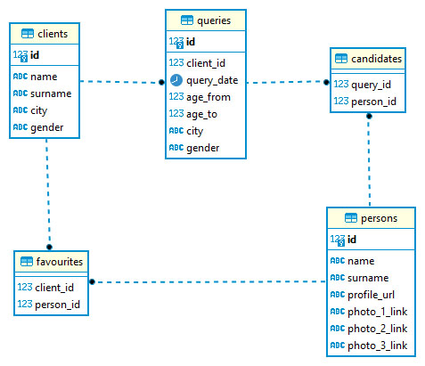
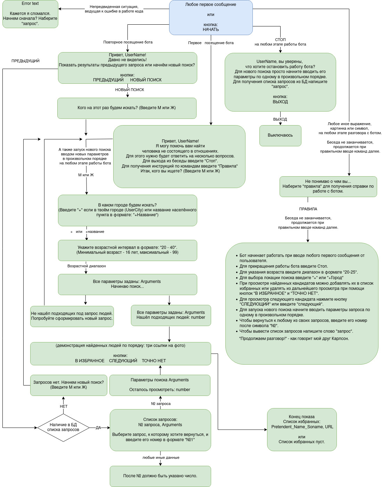

 
# Командный проект по курсу «Профессиональная работа с Python».
## [VKinder]( https://vk.com/club221717166 "VKinder_bot") чат-бот для приложения Вконтакте.

### Цель

Цель командного проекта — разработать программу-бота для взаимодействия с базами данных социальной сети. Бот будет предлагать не состоящих в отношениях претендентов для знакомств в социальной сети ВКонтакте в виде диалога с пользователем.

### Условия

1. Используя информацию о собеседнике бота, а также получая информацию из беседы, бот составляет список претендентов для знакомства.
2. Для решения собеседнику предлагается до трех самых популярных фотографий (изображений), которые определены по количеству лайков.
3. Собеседник бота может перейти к следующему претенденту по кнопке «следующий».
4. Собеседник бота может сохранить понравившегося претендента в список избранных по кнопке «в избранное».
5. Собеседник бота может удалить не понравившегося претендента из результата поиска (удаляется связь собеседник-претендент, чтобы при повторном показе этот претендент не был показан этому собеседнику) по кнопке «точно нет».
6. В результате просмотра всех кандидатов возвращается список избранного в следующем формате:

```
 Имя Фамилия URL профиля
```

7. Собеседник бота может ознакомиться с правилами для лучшего взаимодействия с ботом используя команду «правила».
8. Собеседник бота может покинуть текущий поиск и вернуться к нему по введя «запрос».
9. Собеседник бота может инициировать новый поиск начав вводить данные в произвольном порядке.
10. Собеседник бота может выйти из беседы по команде "стоп".

### Как:

1. Установите требования из файла `requirements.txt`. с помощью следующей команды: `pip install -r requirements.txt`.
2. В пакете logic в модуле service.py нужно внести свой пароль (вместо postgres должен быть ваш уникальный пароль для создания базы данных). Для этого бота мы использовали PosеgreSQL.
3. Перейдите к main.py и запустите файл.
4. Для общения с ботом перейдите по ссылке [ВКиндер_бот](https://vk.com/im?media=&sel=-221717166&v=)
5. Для активации бота нажмите кнопку «начать» или любое сообщение.
6. Следуйте указаниям бота и будут показаны результаты, выбранные по алгоритму из исходной задачи. Если информация отсутствует бот предложит начать новый поиск с другими параметрами.
7. Когда пользователь нажимает кнопку «в избранное», профиль добавляется в список избранных таблиц базы данных. Пользователь имеет возможность просмотреть список избранного, ознакомившись со всеми претендентами.

### Описание программы:
- Пакет bot_api содержит модуль finder.py, который получает данные взаимодействием с API Вконтакте.
- Пакет logic содержит ORM и функционал для работы с БД. Содержит модуль models.py и модуль service.py.



- Модуль bot.py управляет действиями бота. Используются команды, кнопки: 
	- Начать
	- М или Ж 
    - +Город или + 
    - возрастной интервал
    - В избранное или Следующий или Точно нет
    - Предыдущий или Новый поиск 
    - запрос 
    - №запроса 
    - стоп
    - Выход
    - правила 



- Модуль log_module.py - осуществляет логгирование работы бота. Осуществлено 

### Полезные ссылки:
[Как настроить группу и получить токен группы](https://github.com/netology-code/py-advanced-diplom/blob/new_diplom/group_settings.md)

[Получить access токен пользователя](https://vkhost.github.io/)